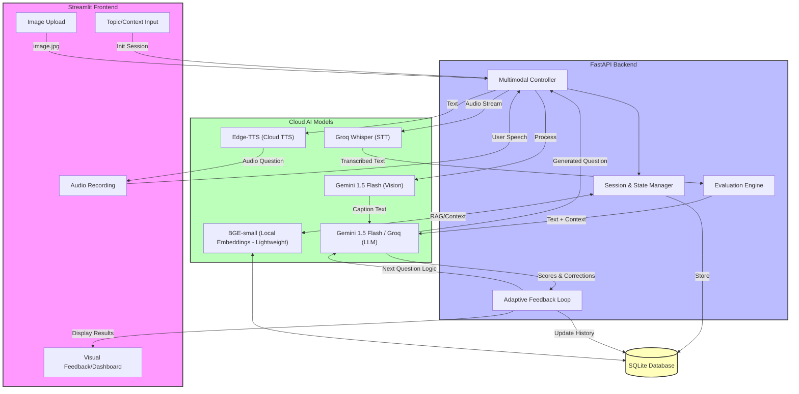

# Multimodal AI Speaking Coach (CPU-Only Local Architecture)

## Overview

This document describes the architecture of a **Multimodal AI Speaking Coach** designed to run **fully locally on CPU with lightweight models**. The system supports:

* Topic input
* Context input
* Image input (IELTS-style speaking)
* Speech input (microphone)
* Speaking evaluation
* Adaptive feedback loop
* Offline operation
* Low hardware requirements

The goal is to build a **local AI speaking assistant** that helps users improve English speaking skills without relying on cloud services.

---

# System Goals

## Primary Goals

* Run on CPU only
* Work offline
* Use lightweight models
* Support IELTS-style speaking practice
* Provide adaptive feedback
* Support multimodal input
* Maintain conversation memory

## Target Machine

* Ubuntu Linux
* 8–16 GB RAM
* CPU only
* No GPU required
* Local deployment

---

# High-Level Architecture



---

# Core Components

## 1. Frontend (Streamlit)

### Responsibilities

* Input topic
* Input context
* Upload image
* Record microphone audio
* Display speaking questions
* Show feedback and scores
* Show progress

### Example Inputs

```
Topic: Travel
Context: IELTS Speaking
Image: airport.jpg
Level: Intermediate
```

---

# 2. FastAPI Backend

## Responsibilities

* Handle API requests
* Route input types
* Manage model calls
* Control speaking flow
* Manage sessions
* Store results

## API Endpoints

### Create Session

```
POST /session
```

### Generate Question

```
POST /generate-question
```

### Upload Image

```
POST /image
```

### Upload Audio

```
POST /audio
```

### Evaluate Speaking

```
POST /evaluate
```

### Get Feedback

```
GET /feedback
```

---

# 3. Speech to Text (Faster-Whisper)

## Purpose

Convert user speech to text.

## Model

Faster-Whisper (base)

## Features

* CPU friendly
* Fast
* Good English accuracy
* Offline

## Output

```
Machine learning is system that learn from data
```

---

# 4. Vision Model (BLIP)

## Purpose

Generate caption from image.

## Example

Input image:

```
airport.jpg
```

Output:

```
people waiting at airport terminal with luggage
```

## Usage

Used to generate IELTS speaking questions.

---

# 5. LLM (Phi-3 Mini)

## Purpose

* Generate speaking questions
* Evaluate answers
* Provide corrections
* Control feedback loop

## Model

Phi-3 Mini (GGUF)

## Runs with

Ollama or llama.cpp

## Example Output

```
Grammar: 6
Fluency: 7
Vocabulary: 5
Pronunciation: 6

Correction:
Machine learning is a system that learns from data
```

---

# 6. Text to Speech (Piper)

## Purpose

Convert AI text to voice.

## Example

```
Describe this picture
```

Output:

Audio speaking question.

## Benefits

* Offline
* Fast
* Lightweight

---

# 7. Embedding Model (BGE-small)

## Purpose

* Store conversation memory
* Track speaking progress
* Support feedback loop

## Usage

```
question similarity
context retrieval
```

---

# Multimodal Flow

## Topic Input

User provides topic.

```
Travel
```

LLM generates question.

```
Why do people travel?
```

---

# Image Input

User uploads image.

BLIP generates caption.

```
airport terminal with passengers
```

LLM generates question.

```
Describe what you see in this image
```

---

# Speech Input

User speaks.

Whisper converts speech to text.

```
People waiting in airport
```

LLM evaluates answer.

---

# Feedback Loop

## Step 1

User answers question.

## Step 2

LLM evaluates speaking.

## Step 3

System generates feedback.

## Step 4

Next question adapts to user level.

### Example

Grammar low → simpler question

Vocabulary low → explanation question

Fluency low → longer speaking question

Pronunciation low → repetition question

---

# Database Design

## SQLite

Lightweight local database.

---

# Table: session

```
id
topic
context
image
level
date
```

---

# Table: speaking_log

```
id
session_id
question
answer
grammar_score
fluency_score
vocab_score
pronunciation_score
feedback
next_question
created_at
```

---

# Project Folder Structure

```
speaking-coach/

├── app/
│   ├── main.py
│   ├── routes/
│   │   ├── session.py
│   │   ├── speech.py
│   │   ├── image.py
│   │   ├── question.py
│   │   └── evaluation.py
│   │
│   ├── services/
│   │   ├── whisper_service.py
│   │   ├── blip_service.py
│   │   ├── llm_service.py
│   │   ├── piper_service.py
│   │   └── feedback_service.py
│   │
│   ├── models/
│   │   ├── session.py
│   │   └── speaking_log.py
│   │
│   ├── database/
│   │   └── sqlite.py
│   │
│   └── utils/
│       ├── prompts.py
│       └── helpers.py
│
├── frontend/
│   └── streamlit_app.py
│
├── models/
│   ├── phi3/
│   ├── whisper/
│   ├── blip/
│   └── piper/
│
├── requirements.txt
├── docker-compose.yml
└── README.md
```

---

# Installation

## Install Ollama

```
curl -fsSL https://ollama.com/install.sh | sh
```

## Run Phi-3

```
ollama run phi3
```

## Install Python Libraries

```
pip install fastapi uvicorn streamlit
pip install faster-whisper
pip install transformers torch pillow
```

## Install Piper

```
sudo apt install piper
```

---

# Running System

## Start Backend

```
uvicorn app.main:app --reload
```

## Start Frontend

```
streamlit run frontend/streamlit_app.py
```

---

# Resource Usage

## RAM

Phi-3: ~4GB

Whisper: ~2GB

BLIP: ~1GB

Piper: ~500MB

FastAPI: ~500MB

## Total

8GB RAM recommended

---

# Features

* Topic-based speaking
* Context-based speaking
* Image-based speaking
* Speech recognition
* AI feedback
* Adaptive question generation
* IELTS speaking practice
* Offline support
* CPU-only deployment

---

# Future Improvements

* Pronunciation scoring
* Conversation memory
* User progress analytics
* Reinforcement learning feedback
* Mobile version
* Web deployment

---

# Final System

## Multimodal Adaptive AI Speaking Coach

### CPU-only

### Local AI models

### Offline capable

### IELTS speaking support

### Feedback loop enabled

---

End of document.
